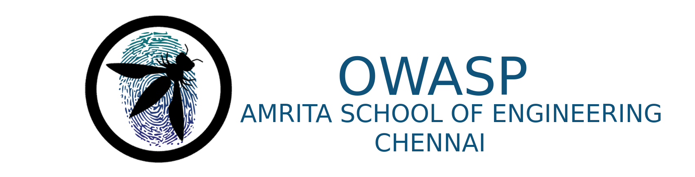

---

layout: col-sidebar
title: OWASP Amrita School of Engineering - Chennai
tags: ASECHN, asechn
region: Asia
meetup-group:

---

OWASP Amrita School Of Engineering University - Chennai was founded in May, 2022. We Organise Meetups, Webinar, CTFs and Conferences. All these events are open, anyone who has interest can participate. We actively create awareness and share knowledge on Cyber Security.   

## Participation
The Open Web Application Security Project (OWASP) is a nonprofit foundation that works to improve the security of software. All of our projects ,tools, documents, forums, and chapters are free and open to anyone interested in improving application security. 

Chapters are led by local leaders in accordance with the [Chapters Policy](/www-policy/operational/chapters). Financial contributions should only be made online using the authorized online donation button. 

Everyone is welcome and encouraged to participate in our [Projects](/projects/), [Local Chapters](/chapters/), [Events](/events/), [Online Groups](https://groups.google.com/a/owasp.com/){:target='_blank'}, and [Community Slack Channel](https://owasp.slack.com/){:target='_blank'}. We especially encourage diversity in all our initiatives. OWASP is a fantastic place to learn about application security, to network, and even to build your reputation as an expert. We also encourage you to be [become a member](/membership/) or consider a [donation](/donate/) to support our ongoing work.

## Call For Speakers

If you are willing to give a talk in our chapter, please feel free to drop an email to one of the student chapter leaders. We will be happy to have you on our list.

Please follow the below structure when you mail us. We will get back to you as soon as possible. 

<b> Subject: </b> Call For Speakers - (Your Name)

<b> Body: </b>

Your Name, Current Designation (If Employed), Topic. If you have LinkedIn profile please attach along with mail 

Next Meeting/Event <!-- You should keep this section as it will populate your meetup events -->
---------------------


